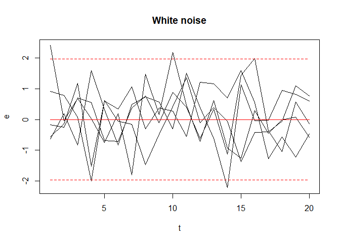
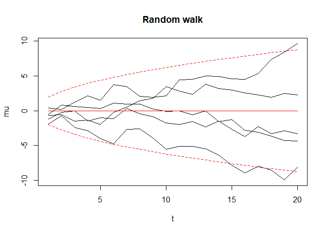
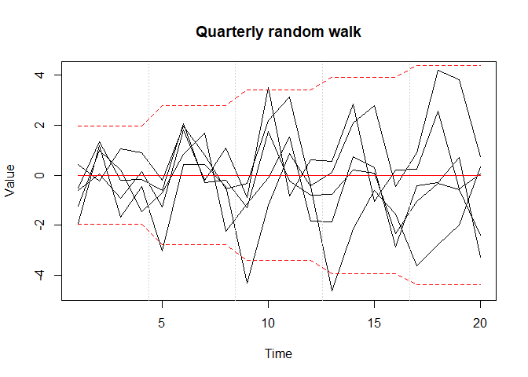
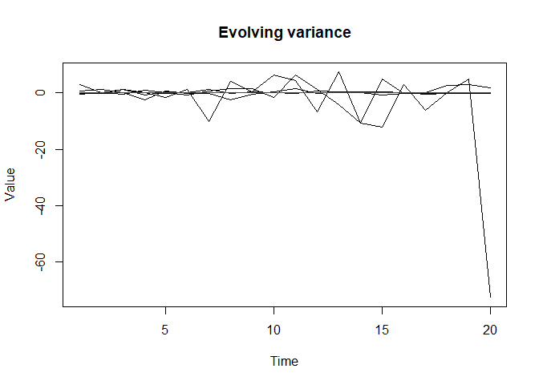
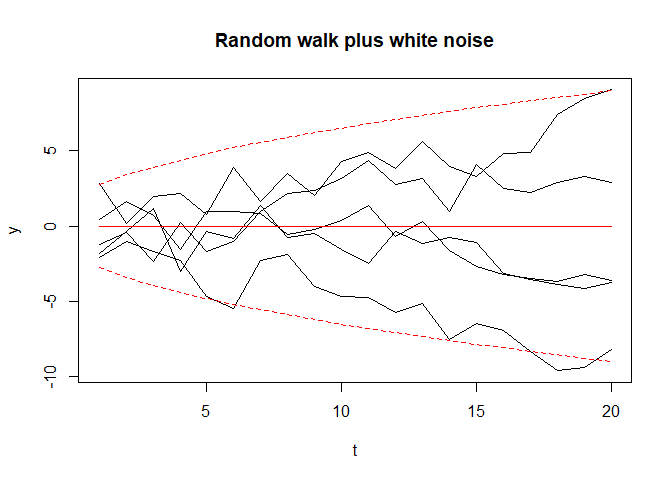
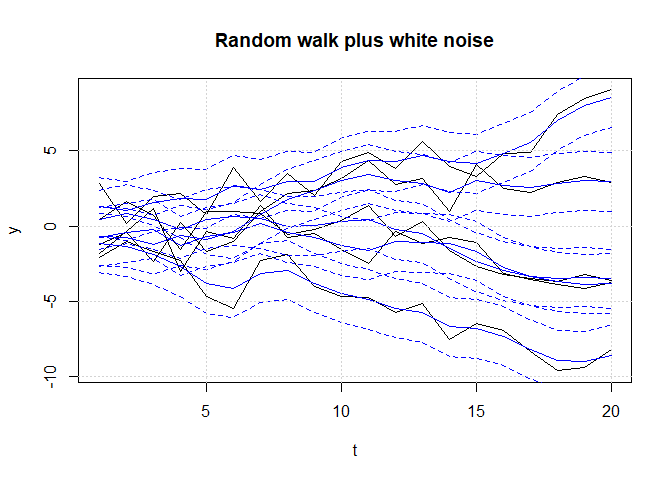

State-space models
================
Robin Aldridge-Sutton
04/04/2021

-   [Definition](#definition)
-   [White noise](#white-noise)
-   [Random walk](#random-walk)
-   [Quarterly random walk](#quarterly-random-walk)
-   [Evolving variance](#evolving-variance)
-   [Filtering for a random walk plus white noise
    model](#filtering-for-a-random-walk-plus-white-noise-model)

### Definition

A state-space model can be made up of:

-   A state variable *x*<sub>*t*</sub>, taking values in some
    state-space
-   An output variable *y*<sub>*t*</sub>
-   An observation equation *P*(*y*<sub>*t*</sub>\|*x*<sub>*t*</sub>)
-   A state transition equation
    *P*(*x*<sub>*t* + 1</sub>\|*x*<sub>*t*</sub>)
-   Where *x*<sub>*t*</sub> and *y*<sub>*t*</sub> satisfy the Markov
    equations:
    *P*(*y*<sub>*t* + 1</sub>, *x*<sub>*t* + 1</sub>\|*y*<sub>*t*</sub>, *x*<sub>*t*</sub>, ..., *y*<sub>1</sub>, *x*<sub>1</sub>) = *P*(*y*<sub>*t* + 1</sub>, *x*<sub>*t* + 1</sub>\|*y*<sub>*t*</sub>, *x*<sub>*t*</sub>)
    *P*(*y*<sub>*t* + 1</sub>\|*x*<sub>*t* + 1</sub>, *y*<sub>*t*</sub>, *x*<sub>*t*</sub>) = *P*(*y*<sub>*t* + 1</sub>\|*x*<sub>*t* + 1</sub>)
-   Which implies that
    *P*(*y*<sub>*t* + 1</sub>, *x*<sub>*t* + 1</sub>\|*y*<sub>*t*</sub>, *x*<sub>*t*</sub>) = *P*(*y*<sub>*t* + 1</sub>\|*x*<sub>*t* + 1</sub>)*P*(*x*<sub>*t* + 1</sub>\|*x*<sub>*t*</sub>)

Obtaining the conditional distribution
*P*(*x*<sub>*t*</sub>\|*y*<sub>*t*</sub>, ..., *y*<sub>1</sub>), from
which *P*(*x*<sub>*t* + 1</sub>) and *P*(*y*<sub>*t* + 1</sub>) can be
derived/sampled, is known as filtering.

### White noise

White noise is the core of a stochastic time series model.

*e*<sub>*t*</sub> ∼ *N*(0, *σ*<sup>2</sup>)

``` r
# Set simulation parameters
n_t <- 20
t <- 1:n_t
n_reals <- 5
n_samps <- n_t * n_reals
quants <- t(matrix(c(0, 1.96, -1.96), nrow = 3, ncol = n_t))
q_lty <- c(1, 2, 2)

# Simulate white noise
e <- matrix(rnorm(n_samps), nrow = n_t)

# Plot it
matplot(t, e, type = 'l', main = "White noise", col = 1, lty = 1)
matlines(t, quants, col = 'red', lty = q_lty)
```

<!-- -->

### Random walk

The steps in a random walk are white noise.

*a*<sub>*t*</sub> ∼ *N*(0, *τ*<sup>2</sup>)
*μ*<sub>*t* + 1</sub> = *μ*<sub>*t*</sub> + *a*<sub>*t*</sub>
*μ*<sub>*t* + 1</sub>\|*μ*<sub>*t*</sub> ∼ *N*(*μ*<sub>*t*</sub>, *τ*<sup>2</sup>)
*u*<sub>0</sub> = 0 ⟹ *μ*<sub>*t*</sub> ∼ *N*(0, *t**τ*<sup>2</sup>)

``` r
# Simulate random walk 
a <- matrix(rnorm(n_samps), nrow = n_t)
mu <- apply(a, 2, cumsum)

# Plot it
matplot(t, mu, type = 'l', main = "Random walk", col = 1, lty = 1)
matlines(t, quants * sqrt(t), col = 'red', lty = q_lty)
```

<!-- -->

### Quarterly random walk

*μ*<sub>*t* + 1</sub> = *μ*<sub>*t* − 3</sub> + *a*<sub>*t*</sub>
*μ*<sub>*t* + 1</sub>\|*μ*<sub>*t* − 3</sub> ∼ *N*(*μ*<sub>*t* − 3</sub>,*τ*<sup>2</sup>)
$$u\_0 = 0 \\implies \\mu\_t \\sim N \\left( 0, ceiling \\left( \\frac{t}{4} \\right) \\tau^2 \\right)$$

``` r
# Simulate quarterly random walk 
mu_q <- apply(a, 2, function(column) 
  as.vector(t(apply(matrix(column, ncol = 4, byrow = T), 2, cumsum))))

# Plot it
matplot(mu_q, type = 'l', xlab = "Time", ylab = "Value",
        main = "Quarterly random walk", col = 1, lty = 1)
grid(nx = n_t / 4, ny = NA)
matlines(t, quants * sqrt(ceiling(t / 4)), col = 'red', lty = q_lty)
```

<!-- -->

### Evolving variance

*h*<sub>*t* + 1</sub> = *h*<sub>*t*</sub> + *a*<sub>*t*</sub>
$$y\_t = \\exp \\left( \\frac{h\_t}{2} \\right) e\_t$$
*y*<sub>*t*</sub> ≁ *N*
*y*<sub>*t*</sub>\|*h*<sub>*t*</sub> ∼ *N*(0, exp (*h*<sub>*t*</sub>))
*h*<sub>0</sub> = 0 ⟹ log {*v**a**r*(*y*<sub>*t*</sub>)} ∼ *N*(0, *t**τ*<sup>2</sup>)

``` r
# Simulate evolvng variance
h <- mu
y_v <- exp(h / 2) * e

# Plot it
matplot(y_v, type = 'l', xlab = "Time", ylab = "Value",
        main = "Evolving variance", col = 1, lty = 1)
lines(rep(0, n_t), col = 'red')
```

<!-- -->

### Filtering for a random walk plus white noise model

*y*<sub>*t*</sub> = *μ*<sub>*t*</sub> + *e*<sub>*t*</sub>
*y*<sub>*t*</sub>\|*μ*<sub>*t*</sub> ∼ *N*(*μ*<sub>*t*</sub>, *σ*<sup>2</sup>)
*y*<sub>*t*</sub> ∼ *N*(0, *t**τ*<sup>2</sup> + *σ*<sup>2</sup>)

``` r
# Simulate and plot random walk plus white noise
y <- mu + e
matplot(t, y, type = 'l', main = "Random walk plus white noise", col = 1, 
        lty = 1)
matlines(t, quants * sqrt(t + 1), col = 'red', lty = q_lty)
```

<!-- -->
*x*<sub>*t*</sub> := *μ*<sub>*t*</sub>
*ỹ*<sub>*t*</sub> ∼ *N*(*x̃*<sub>*t*</sub>, *σ*<sup>2</sup>*I*<sub>*t*</sub>)
*x̃*<sub>*t*</sub> ∼ *N*(*x̃*<sub>*t* − 1</sub>, *τ*<sup>2</sup>*I*<sub>*t*</sub>)
 ⟹ (*x̃*<sub>*t*</sub>, *ỹ*<sub>*t*</sub>) ∼ *N*
*E*(*x̃*<sub>*t*</sub>\|*ỹ*<sub>*t*</sub>) = *E*(*x̃*<sub>*t*</sub>) + *C**o**v*(*x̃*<sub>*t*</sub>, *ỹ*<sub>*t*</sub>)*V**a**r*(*ỹ*<sub>*t*</sub>)<sup> − 1</sup>{*ỹ*<sub>*t*</sub> − *E*(*ỹ*<sub>*t*</sub>)}
*V**a**r*(*x̃*<sub>*t*</sub>\|*ỹ*<sub>*t*</sub>) = *V**a**r*(*x̃*<sub>*t*</sub>) − *C**o**v*(*x̃*<sub>*t*</sub>, *ỹ*<sub>*t*</sub>)*V**a**r*(*ỹ*<sub>*t*</sub>)<sup> − 1</sup>*C**o**v*(*ỹ*<sub>*t*</sub>, *x̃*<sub>*t*</sub>)
*E*(*x̃*<sub>*t*</sub>) = *E*(*ỹ*<sub>*t*</sub>) = 0
*C**o**v*(*x̃*<sub>*t*</sub>, *ỹ*<sub>*t*</sub>) = *C**o**v*(*ỹ*<sub>*t*</sub>, *x̃*<sub>*t*</sub>)′ = (*C**o**v*(*x̃*<sub>*t*</sub>, *x̃*<sub>*t*</sub>) + *C**o**v*(*ẽ*<sub>*t*</sub>, *x̃*<sub>*t*</sub>))′ = *V**a**r*(*x̃*<sub>*t*</sub>)
*V**a**r*(*ỹ*<sub>*t*</sub>) = *V**a**r*(*x̃*<sub>*t*</sub>) + *σ*<sup>2</sup>*I*<sub>*t*</sub>
$$
\\begin{bmatrix} 
1  & &  &\\\\ 
-1 & 1 & & \\\\ 
& ... & \\\\ 
 & & -1 & 1 \\\\ 
\\end{bmatrix}
\\begin{bmatrix} 
x\_1 \\\\ 
... \\\\ 
x\_t \\\\ 
\\end{bmatrix} = 
\\begin{bmatrix} 
1 \\\\ 
 \\\\ 
 \\\\ 
\\end{bmatrix} x\_1 + 
\\begin{bmatrix} 
a\_1 \\\\ 
... \\\\ 
a\_t \\\\ 
\\end{bmatrix}
$$
*D*<sub>*t*</sub>*x̃*<sub>*t*</sub> = *g̃*<sub>*t*</sub>*x*<sub>1</sub> + *ã*<sub>*t*</sub>
*D*<sub>*t*</sub>*V**a**r*(*x̃*<sub>*t*</sub>)*D*<sub>*t*</sub>′ = *K*<sup>2</sup>*g̃*<sub>*t*</sub>*g̃*<sub>*t*</sub>′ + *τ*<sup>2</sup>*I*<sub>*t*</sub>
*x*<sub>1</sub> ∼ *N*(0, *K*<sup>2</sup>)
*V**a**r*(*x̃*<sub>*t*</sub>) = *K*<sup>2</sup>*D*<sub>*t*</sub><sup> − 1</sup>*g̃*<sub>*t*</sub>*g̃*<sub>*t*</sub>′*D*<sub>*t*</sub>′<sup> − 1</sup> + *τ*<sup>2</sup>*D*<sub>*t*</sub><sup> − 1</sup>*D*<sub>*t*</sub>′<sup> − 1</sup>
*E*(*x̃*<sub>*t*</sub>\|*ỹ*<sub>*t*</sub>) = *V**a**r*(*x̃*<sub>*t*</sub>){*V**a**r*(*x̃*<sub>*t*</sub>) + *σ*<sup>2</sup>*I*<sub>*t*</sub>}<sup> − 1</sup>*ỹ*<sub>*t*</sub>
*V**a**r*(*x̃*<sub>*t*</sub>\|*ỹ*<sub>*t*</sub>) = *V**a**r*(*x̃*<sub>*t*</sub>) − *V**a**r*(*x̃*<sub>*t*</sub>){*V**a**r*(*x̃*<sub>*t*</sub>) + *σ*<sup>2</sup>*I*<sub>*t*</sub>}<sup> − 1</sup>*V**a**r*(*x̃*<sub>*t*</sub>)
 ⟹ *x̃*<sub>*t*</sub>\|*ỹ*<sub>*t*</sub>
 ⟹ *ỹ*<sub>*t* + *k*</sub>\|*ỹ*<sub>*t*</sub>
*K* = 0, *τ* = 1, *σ* = 1 ⟹ *V**a**r*(*x̃*<sub>*t*</sub>) = *D*<sub>*t*</sub><sup> − 1</sup>*D*<sub>*t*</sub>′<sup> − 1</sup>

``` r
# Compute filter given all samples for each realization
D <- diag(n_t)
D[cbind(2:n_t, 1:(n_t - 1))] <- -1
var_x_t <- solve(D) %*% solve(t(D))
E_x_given_y <- var_x_t %*% solve(var_x_t + diag(n_t)) %*% y

# Plot it
matplot(t, y, type = 'l', main = "Random walk plus white noise", col = 1, 
        lty = 1)
quant_reps <- matrix(rep(c(0, 1.96, -1.96), each = n_samps), nrow = n_t)
filt_quants <- matrix(E_x_given_y, nrow = n_t, ncol = n_reals * 3)
matlines(t, filt_quants + quant_reps, col = 'blue', lty = rep(q_lty, each = n_reals))
grid()
```

<!-- -->

``` r
# CI's look a bit wide but it's hard to tell, might be OK
```
